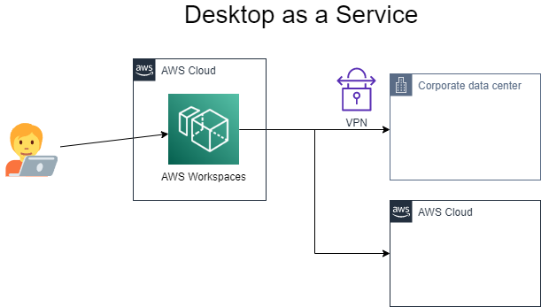
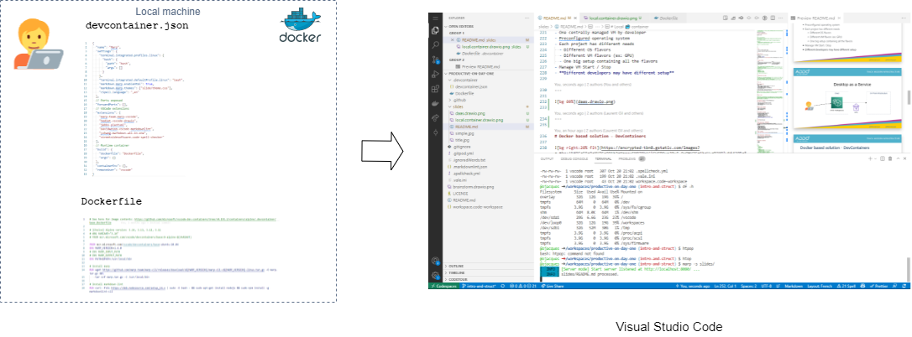

<!--
Making dev and ops productive on day 1 and ever after

In your software powered company, nothing is more important than developer and operations productivity. Ideally, one should be able make change in production - through the safety of a CI and CD pipeline - on day 1 on the job. This talk shares multiple recipes that we have put in place to get to this "productive on day 1" ideal, including on very restrictive and regulated environments. The PC/MAC itself, the Integrated Developer Environment (IDE), running the service or application locally, as well as everything needed to manage infrastructure. We go through different solutions for 3 typical profiles: a front-end developer, a data scientist and an infrastructure as code developer.

-->

<!--
Agenda / Slides

- Intro: why dev productivity is important? What if you don't do anything about it?
- What gets in the way of developer productivity?
  - Machine / PC / MAC *
  - Access to company portal
  - Access to productivity tools (DaaS/VDI, GIT host, ...) *
  - Access to privileged accounts (cloud, ...)

- (Breaking use cases into multiple types of config)

- Configuring your "machine"
  - Case A: Old style - word doc to configure. Discrepancies between developers
  - Case B: Local VMs (Vagrant):
    - good: start to have common components.
    - not so good: But not project specific. Missing config (need Ansible, Chocolatey or other). Need lots of RAM/CPU
  - Case C: VMs in the cloud:
    - good: as much capacity as needed. Low requirements on local machine.
    - not so good: shared images managed by IT, not admin
  - Case D: Docker. DevContainers, local, remote (codespaces), oktekto / GitPod
    - good:
      - Dev env can also be used for CI/CD
    - Docs:
      - https://code.visualstudio.com/docs/containers/choosing-dev-environment#_remote-machine
      - https://github.com/hypescaler/aws-vscode-remote-containers#managed-vs-code-remote-dev-environments
  - Case D+: language specific isolations (Python VirtualEnv, other)
  - Case E: Dare to mix everything.
    - Docker aliases
- GitLab/GitPod GitHub/CodeSpaces
- Additional use cases:
  - Accessing secrets (trusted roles / Azure Service Principals)
  - Authorization: via Directory groups / LDAP

- DEMO - 15 min
  - Laurent: I'm on my local VM, I debug locally (devcontainer)
  - Olivier: I have nothing installed, but VSCode, I debug remotely
  Small Python Hello World (with a loop)
-->

<!--
speaker: Olivier

Thank you. Today, Laurent and I are going to talk about "Documentation as Code" and more specifically CI and CD for documentation.

But first, let us introduce ourselves:

Speakers: Olivier & Laurent
- Short intro

(NOTE: embed Olivier & Laurent's faces / OBS)

Laurent:
Hello I am Laurent, I also work for DXC Technology where I am acting internally as a DevOps Coach and externally as a CI and CD expert. I hope we will manage to show you the benefits of the CI and CD practices for documentation as code, as well as how easy it is to do it.
-->
<!--backgroundImage: url('https://github.com/GoDevOps/productive-on-day-one/raw/main/slides/title.jpg')-->
<!-- _color:white -->
 
 
 
 

# Making Dev & Ops Productive

# on day 1

## ...and ever after

---

<!--backgroundImage: url('https://github.com/GoDevOps/productive-on-day-one/raw/main/slides/simple.jpg')-->

The quest for productivity

# 👩‍💻👨‍💻🏰🦄🤴👸🐴👻⚔🗡🏴‍☠️

And why we care

<!--

Back to this presentation.

This presentation is an experience report, because we have learned so much from others through this format.

This presentation is about our quest: the quest for developer productivity.

Previously,
- It would take weeks, sometimes months for a new Dev or Ops to be productive
- Getting access to systems was a quest in itself
- ...

Today, it's a very different situation
- ...

-->

---

# Facts

1. You are a software powered company

2) Developer's productivity impacts directly business outcomes

---

# Whose job is it?

Depending on the size of the company:

- Toolsmiths
- A job title: **DevEx**
- An "Enablement team" (📘 [Team Topologies](https://teamtopologies.com/), Skelton & Pais).

---

# 3 topics, 3 metrics

| Topic                                    | Metric                  |
| ---------------------------------------- | ----------------------- |
| 🧑‍💻Bootstrapping a development environment | Time to 1st code commit |
| 🏭CI & CD to test and deploy              | Time to test and deploy |
| 📊Observability                           | Time to get feedback    |

<!--

- First is when you go from 0 to some code / artifacts
- Then you need to share / integrate with the rest of the team and eventually put it in the hands of your customer
- Finally, it is about enabling observability and give clarity to what is happening to the developers

In summary:
- Productive as 1 dev,
- productive as a team,
- operational excellence

Let's focus on the first point -->

---

# Improving Time to 1st commit

<!-- 
- The topic of CI & CD has been covered by many talks in previous years at ADDO, and this year again. So, we won't be diving deep. 
- Less so for observability, but this is topic where significant progress has been made, notably with thought leaders such as Charity Majors
- We will focus on the first topic, which is to improve the time to 1st commit

-->

# 🚫 ➡️ 🧑‍💻

---
# How it often goes 🧐
- Get a PC/MAC
- VPN
- Install Integrated Developer Environment tool (IDE), GIT
- Install language / libraries / SDKs
- Install debugger / linters / test tools
- Get access to the repository / get credentials
- Does it compile, yet?

📘 "The First Ideal": locality and simplicity, from [The Unicorn Project](https://itrevolution.com/the-unicorn-project/), Gene Kim

<!--
Whether you are a new hire, or someone new to the team, it takes time to be ready to code. Let's look at everything involved, in a very classical way.
-->

---
# DevEnv as Code

<!--
As developers or IT operation guy  your probably know the "It works on my machine" syndrome. Development Environment As Code can help to avoid this kind of troubles as you will be able to have exactly the same environment during the development than in the CI/CD pipeline or in production.
-->

## "It works on my machine!"

- Offers easy to start development environment
- Control dependencies
- Code review on development environment changes
- Secure credentials
- Improve segregation between projects which may be for different clients

---

# DevEnv as Code - Solutions

## Pet way
- based on virtual machines

## Cattle way

- based on docker containers
- based on Kubernetes

---

# DaaS (Desktop as a Service)

- One centrally managed VM by developer
- Preconfigured operating system
- Each project has different needs
  - Different OS flavors
  - Different VM flavors (ex: GPU)
  - One big setup containing all the flavors
- Manage VM Start / Stop
- **Different developers may have different setup**

---

---

# Docker based solution - DevContainers

- Integrated with VS Code
- Configure dependencies
- Configure VSCode extensions
- Configure resource usage
- Required local docker host
  - May work with remote docker hosts (ex: Docker Desktop for Windows)
- Required the Remote-Development extension

---
# Local 🐳 container

---

# Docker based solution - GitHub code space

- Based on `devcontainer` (thus same features)
- IDE hosted online, accessible from a web browser
- May work with a local VSCode instance
- Self-hosted solution

---

# DevContainer in Kubernetes - GitPods

- It is a container orchestrator thus we retrieve the previous benefits
- All the good benefits of Kubernetes in matter of :
  - resource usage
  - multi tenancy
  - cost management
- Full browser based development environment

---

<!--
# Notes

- Operations
  - Authentication
  - Authorization

- Developers
  - GitHub DevContainer
    - Container is hosted on GitHub CodeSpaces
  - VSCode DevContainer
    - Container is hosted in local Docker
- DevContainer in kubernetes : https://okteto.com/blog/vs-code-remote-development-in-kubernetes/

https://marketplace.visualstudio.com/items?itemName=okteto.remote-kubernetes

Okteto sounds amazing, let's give it a shot

-->

---

# Time for a li'l demo?

# 🕯️

---
# Thank you 🙏
