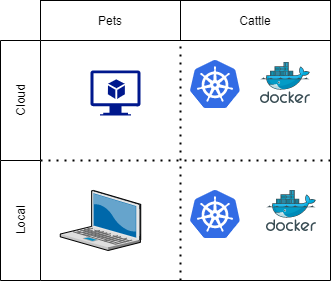

<!--
Olivier 👇

Thank you. Today, Laurent and I are going to share our experience on what makes developers productive.
In software powered companies, nothing is more important than developer and operations productivity. Ideally, one should be able to make a change in production - through the safety of a CI and CD pipeline - on day 1 on the job.
This is a difficult state to achieve, but between where many developers are today, and that ideal state, a number of in-between states are possible.
This is what we are going to talk about today.

But first, let us introduce ourselves:

Olivier:
Laurent 👇
Hello I am Laurent, I work for DXC Technology where I am acting as DevOps Coach and CI and CD expert for our customers. I hope at the end of this talk you will fall for development environment as code.
-->

<!--backgroundImage: url('https://github.com/GoDevOps/productive-on-day-one/raw/main/slides/title.jpg')-->
<!-- _color:white -->
 
 
 
 

# Making Dev & Ops Productive

# on day 1

## ...and ever after

---

<!--backgroundImage: url('https://github.com/GoDevOps/productive-on-day-one/raw/main/slides/simple.jpg')-->

The quest for productivity

# 👩‍💻👨‍💻🏰🦄🤴👸🐴👻⚔🗡🏴‍☠️

And why we care

<!--
Olivier 👇
Back to this presentation.
This presentation is an experience report, because we have learned so much from others through this format.
This presentation is about our quest: the quest for developer productivity.

When we talk with our customers, they are telling us that:
- Developer productivity directly impacts their business
- Working remote has exposed a new set of challenges: almost overnight, developers had to be equipped with laptops to be able to work from home - we are talking about challenges on both capability but also security front
- They need help in making sense of all the technology and services available today to address those challenges

We are about to share how we look at this space, and how to improve.

-->

---

# Statements

1. You are a software powered company

2) Developer's productivity directly impacts business outcomes

<!--
First, some statements.
-->
---

# Whose job is it?

Depending on the size of the company:

- Everyone's (or nobody's) job
- Toolsmiths
- A job title: **DevEx**
- An "Enablement team" (📘 [Team Topologies](https://teamtopologies.com/), Skelton & Pais).

  

📊 Deepnote: [how many toolsmiths should you have](https://deepnote.com/@kunal-bhalla/How-many-Toolsmiths-should-you-have-iq7ofAd0TOy4jq0jk2mB9Q) by [🐤@kunalbhalla](https://twitter.com/kunalbhalla)

<!--
Developer productivity is key, but whose job is it?
The answer can depend on the size of the company...
-->
---

# 3 topics, 3 metrics

| Topic                                        | Metric                  |
| -------------------------------------------- | ----------------------- |
| 🧑‍💻Bootstrapping a development environment | Time to 1st code commit |
| 🏭CI & CD to test and deploy                 | Time to test and deploy |
| 📊Observability                              | Time to get feedback    |

<!--
We can divide the topic of productivity into 3 topics, which we can measure with 3 synthetic metrics:
- First is when you go from 0 to some code / artifacts
- Then you need to share / integrate with the rest of the team and eventually put it in the hands of your customer
- Finally, it is about enabling observability and give clarity to what is happening to the developers

In summary:
- Productive as 1 dev,
- productive as a team,
- operational excellence

- The topic of CI & CD has been covered by many talks in previous years at ADDO, and this year again. So, we won't be diving deep. 
- Less so for observability, but this is topic where significant progress has been made, notably with thought leaders such as Charity Majors

Let's focus on the first point -->

---

# Improving Time to 1st commit

<!--
We will focus on the first topic, which is to improve the time to 1st commit.
This is the time that it takes for a developer or more generally a contributor to actually contribute.

-->

# 🚫 ➡️ 🧑‍💻

---
# How it often goes 🧐
- Get a PC/MAC
- VPN
- Install Integrated Developer Environment tool (IDE), GIT
- Install language / libraries / SDKs
- Install debugger / linters / test tools
- Get access to the repository / get credentials
- Does it compile, yet?

📘 "The First Ideal": locality and simplicity, from [The Unicorn Project](https://itrevolution.com/the-unicorn-project/), Gene Kim

<!--
Whether you are a new hire, or someone new to the team, it takes time to be ready to code. Let's look at everything involved, in a very classical way.
-->

---
# DevEnv as Code

<!--
Laurent 👇
As developers or IT operation person, you probably know the "It works on my machine" syndrome. Development Environment As Code can help to avoid this kind of troubles as you will be able to have exactly the same environment during the development than in the CI/CD pipeline or in production.
-->

## Avoiding "It works on my machine!"

- Offers easy to start development environment
- Control dependencies
- Code review on development environment changes
- Secure credentials
- Improve segregation between projects which may be for different clients

---

# DevEnv as Code - Solutions

<!--
Development Environment as code is another step in the everything as code journey. Such as infrastructures moving from bare metal servers configured with script, to cloud infrastructure fully built and configured as code, the development environments are evolving.

with the emergence of new technologies such as containers, development environments can now move from being pets to be cattle.
-->

## Pet way

- based on virtual machines

## Cattle way

- based on Docker containers
- based on Kubernetes

---

# DaaS (Desktop as a Service)

- One centrally managed VM by developer
- Preconfigured operating system
- Each project has different needs
  - Different OS flavors
  - Different VM flavors (ex: GPU)
  - One big setup containing all the flavors
- Manage VM Start / Stop
- **Different developers may have different setup**

---
<!--
Olivier 👇
This is an example on how DaaS can be put in place, leveraging AWS Workspaces.

What developers are telling us is that they need something more lightweight than a full VM to work with.
They need something that they can open quickly, directly in their web browser and get a local development experience.
At AWS, the solution which fits that need is called AWS Cloud9. You get an IDE in your browser (Chrome for example), and an environment pre-populated with tools so that you can start developing and debugging right away.

-->

---
<!--
Laurent 👇
DaaS is very useful and fit many needs. 
Now, we also hear a lot from our developers is that they would love:
- Additional flexibility to install what they need
- Manage the environment "as code", next to the code repository
- Take the environment with them
- Integrate with other tools, locally on their PC
- Run several environments, in parallel
- Switch easily between dedicated, specialized environments
-->

# What if I told you...
## Development environment in a container
# 🤯

---

# Docker based solution - DevContainers

- Leverage [Remote containers](https://code.visualstudio.com/docs/remote/create-dev-container) VSCode extension
- Configure dependencies
- Configure VSCode extensions
- Configure resource usage
- Local or remote Docker host
- Require the Remote-Development extension

---
<!--
Devcontainers leverages 2 concepts: devcontainer.json and the container environment itself
-->

## `devcontainer.json`

- IDE extensions and configuration
- Ports to expose
- Commands after it connects (post-create)

## Container environment 🐳

- Any image on Docker hub
- Bring Your Own `Dockerfile`
- Bring Your Own `docker-compose.yml`

---
<!--
You can have everything locally, on your own machine. The IDE and the development environment.
This is used when:
- You need the development environment "as code", but must stay on a local environment (example: running tests with a mobile phone attached to your PC or a piece of hardware)
- You have big enough developer PCs (RAM and CPU to be considered)
-->

- Benefits of development environment "as code"
- Connects to local environment
- Requires big enough developer machines

---

<!--
You have the choice of going remote.
In case you need extra resources (lots of CPU, RAM) or specialized resources (like MAC or ARM), you can leverage remote development containers.
Containers can be hosted on a Kubernetes environment.
-->

- All the benefits of Kubernetes in terms of :
  - resource usage
  - multi tenancy
  - cost management
- Full browser based development environment

---

# Docker based solution - GitHub Codespaces

- Based on `devcontainer` (thus same features)
- IDE hosted online, accessible from a web browser
- May work with a local VSCode instance
- Self-hosted solution

---

# Demo time!

---

# Thank you 🙏

<!--
In conclusion,
- Developer productivity is important
- Start by measuring the onboarding experience on a project (time to 1st commit)
- That space has evolved drastically and we need to stay aware of new capabilities to maximize business outcomes
-->
